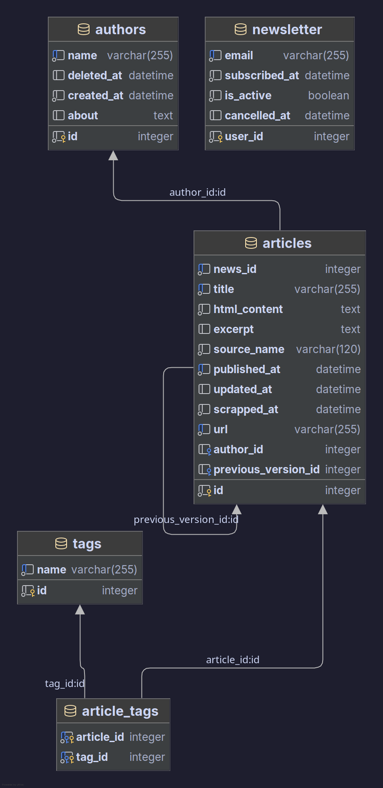

# Documentação Técnica - Portum Repositorium

## 1. Título do projeto

Portum Repositorium, o repositório local de notícias sobre o Porto Central

## 2. Integrantes

- Rafael Venturini Dipalma - 202414319

## 3. Descrição geral do produto e funcionalidades

Portum Repositorium é uma aplicação web em Flask que coleta (scraping) notícias de fontes públicas relacionadas ao Porto
Central, persiste em um banco SQLite e apresenta uma interface com listagem de notícias, detalhes e possibilidade de
inscrição em newsletter.

Funcionalidades principais:

- Scraping de posts do WordPress do Porto Central (API REST /wp-json/wp/v2/posts).
- Scraping de notícias no site da Prefeitura de Presidente Kennedy.
- Persistência de artigos, autores, tags e inscrição de e-mails para newsletter.
- Interface pública com páginas: index, news, news_detail, newsletter, about.
- CLI com comandos para criar/dropar o DB, popular (seed), e executar scraping independente.
- Testes automatizados (pytest) cobrindo rotas e integrações básicas.

## 4. Diagrama do banco de dados (ER)



## 5. Detalhamento técnico das principais partes do código

- `app.py` — Application Factory `create_app(test_config=None)` que configura app, extensões e registra blueprints.
- `repository/ext/` — extensões: `db` (SQLAlchemy), `wtf` (CSRF), `config` (dotenv), `cli` (comandos flask),
  `debugtoolbar`.
- `repository/models/` — modelos SQLAlchemy: `articles.py`, `authors.py`, `tags.py`, `article_tags.py`, `newsletter.py`.
- `repository/services/scrappers/` — scrapers: `porto_central.py` (usa REST WP API) e `presidente_kennedy.py` (parses
  HTML)
- `repository/services/helpers/` — helpers: `save_article.py` (persistência e associação de tags), `tagger.py` (regras
  de detecção de tags), `parsers/` (parsers específicos por fonte).
- `repository/forms/main.py` — formulário WTForms para newsletter.
- `repository/views/` — blueprint `main` com rotas públicas e lógica de formulário.
- `repository/ext/cli/__init__.py` — comandos de linha: `create-db`, `drop-db`, `scrape-news`, `seed-db`,
  `reset-database`.

## 6. Arquitetura adotada

- Flask com Application Factory (módulo `app.create_app`), separação por camadas: `ext` (extensões), `models`,
  `services` (scrapers e helpers), `views` (blueprints) e `templates`.
- ORM: Flask-SQLAlchemy com modelos definidos em arquivos separados.
- CLI para tarefas administrativas (scraping, seed, create-db).

## 7. Tecnologias utilizadas

- Python 3.14
- Flask
- Flask-WTF
- Flask-SQLAlchemy
- SQLAlchemy 2.x
- BeautifulSoup4
- Playwright (listado como dependência para futuros scrapers)
- pytest (testes)
- dotenv (para variáveis de ambiente)

## 8. Justificativa da escolha tecnológica

- Flask: framework leve e adequado para projetos acadêmicos e APIs rápidas.
- SQLAlchemy/Flask-SQLAlchemy: flexibilidade e boa integração com Flask.
- BeautifulSoup: parser HTML robusto, simples de usar para scraping leve.

## 9. Passo a passo para execução do projeto (local)

1. Crie e ative um virtualenv (opcional):

```bash
python -m venv .venv
source .venv/bin/activate
```

2. Instale dependências usando o wrapper `uv` (conforme convenção deste projeto):

```bash
uv run pip install -e ".[test,dev]"
```

3. Configurar variáveis de ambiente (exemplo `.env`):

```text
SECRET_KEY=uma_chave_aleatoria
FLASK_DEBUG=1
DATABASE_URL=sqlite:///repository.db
```

4. Criar banco de dados e popular seed (tags + scraping inicial):

```bash
export FLASK_APP=repository
uv run flask create-db
uv run flask seed-db

// caso seja desejado, pode-se executar apenas o scraping,
// a fim de atualizar os dados ou coletar novas noticias
uv run flask scrape-news 
// pode ser usada a tag --limit=X onde x é um numero,
// a fim de coletar mais noticias do portocentral.com.br
```

5. Rodar aplicação em desenvolvimento:

```bash
export FLASK_APP=repository
uv run flask run
```

6. Rodar testes:

```bash
uv run pytest -q
```

## 10. Principais desafios encontrados e soluções adotadas

- Sanitização de html
    - Inicialmente o scraper coletava todo o html considerado da noticia, porem isso significava que tags de imagens,
      icones, e outras tags irrelevantes para o projeto seriam coletadas
    - Para resolver esse problema foi utilizado funções do bs4 para deixar apenas as tags de texto, e se existissem
      alguma tag de link manter ela com sua referencia, alem de limpar todas as classes.
- Detecção de Tags
    - Escolher tags para o projeto é uma tarefa interessante, pois a organização das noticias dependem disso, já que é
      bem possivel q alguma tag chame a atenção de algum leitor.
    - Para isso foi escolhido palavras chaves para ser as tags e diversos sinônimos para cada palavra chave, assim tendo
      uma boa tentativa de filtro e categorização das noticias.
- Scraping de fontes diferentes
    - Atualmente o scraping tem apenas duas fontes, mas com apenas essas duas já foi possivel ter uma noção bem sólida
      de como é coletar dados de sites diferentes
    - Para um site feito em WordPress foi definitivamente uma tarefa bem tranquila, mas um site como o do governo, que
      foi necessario acessar as paginas, foi um pouco mais complexo, principalmente achar classes e tags condizentes com
      o que eu queria coletar.
- Venv e Pyproject.toml
    - Python não é uma linguagem que eu tenho muito costume de utilizar, então pra mim utilizar o pyproject pela
      primeira vez foi bem frustrante, já que eu tive q fazer o projeto trocando varias vezes de máquina, eu perdia as
      dependencias instaladas por não atualizar manualmente o pyproject
    - Para resolver isso utilizei da lib uv, que facilita muito o gerenciamento geral de pacotes no projeto, me
      facilitando MUITO na hora de pegar o projeto para dar andamento em outra máquina